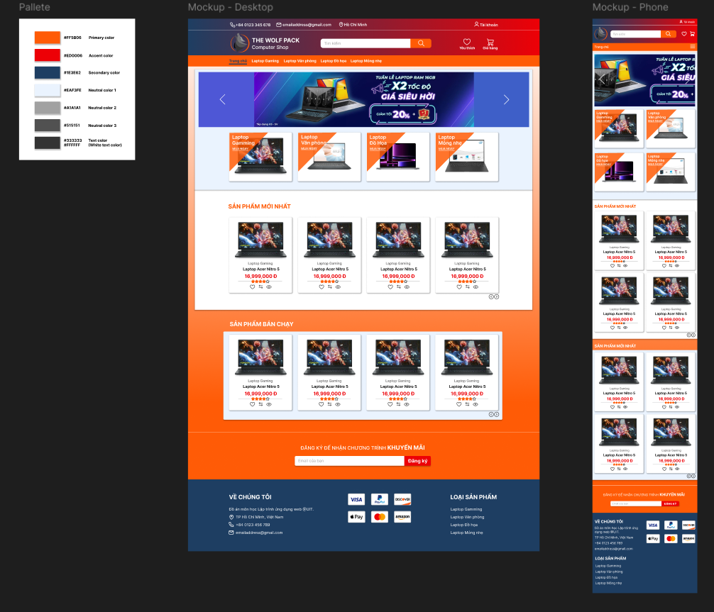
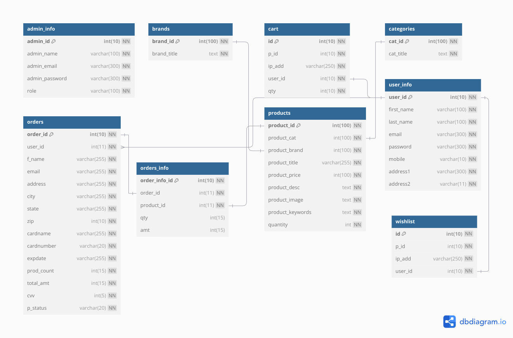
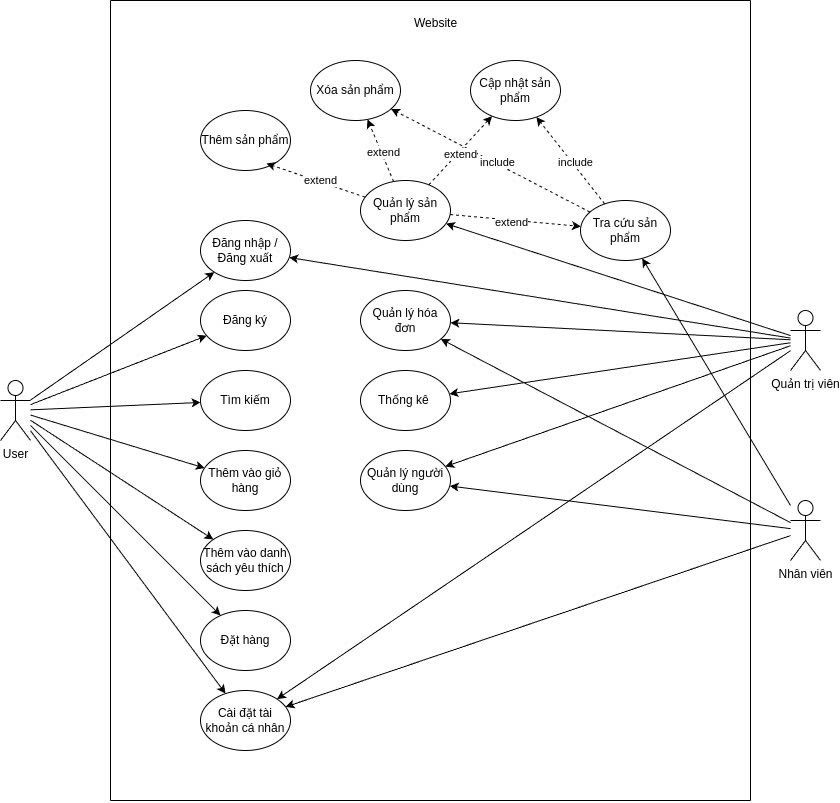

# THE WOLF PACK COMPUTER ONLINE SHOP
## Team members
- Nguyen Chi Vi - 22521656
- Trinh Nguyen Bao Tin - 22521482
- Duong Van Sua - 22521267
- Vo Duc Vinh - 22521684
## Introduction
The TWP Computer Shop project is dedicated to creating a e-commerce website that focuses on selling laptops to a wide range of customers. 

Key features of the website include a secure user registration and login system. Advanced search and filtering options will enable users to quickly find laptops that meet their specific needs, such as brand, price range, or additional features. The user will be divied into different roles (include user, manager, employee).
## Design
This is the figma design for home page of the website: 

#### Click [HERE](https://www.figma.com/design/b6D7UhRYbGIXfgjVsdfHnp/TWP-Computer-Shop?node-id=0-1&m=dev&t=FdETl2woqj5jFhzs-1) to see the design fully!

## Database

## Usecase model

## Installation
Clone the project and setting up database(phpmyadmin) via XAMPP. You can import database from `/Database/dbwebsite.sql`

## Screenshots
There are some screenshots of the website:
### User role

### Admin role

